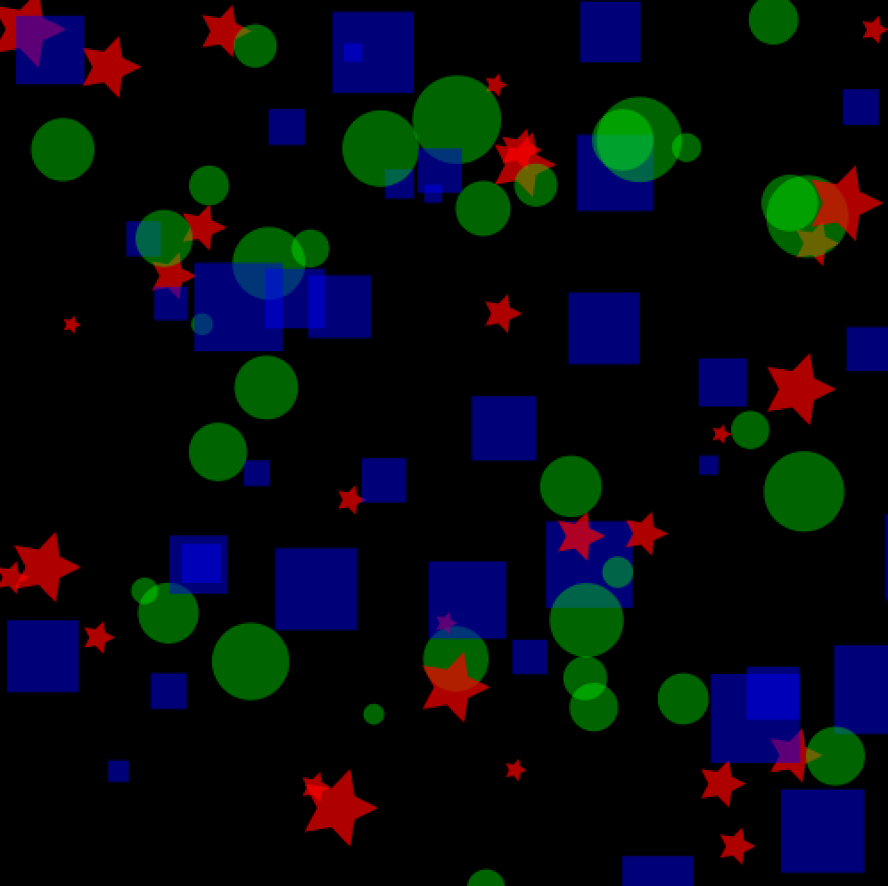
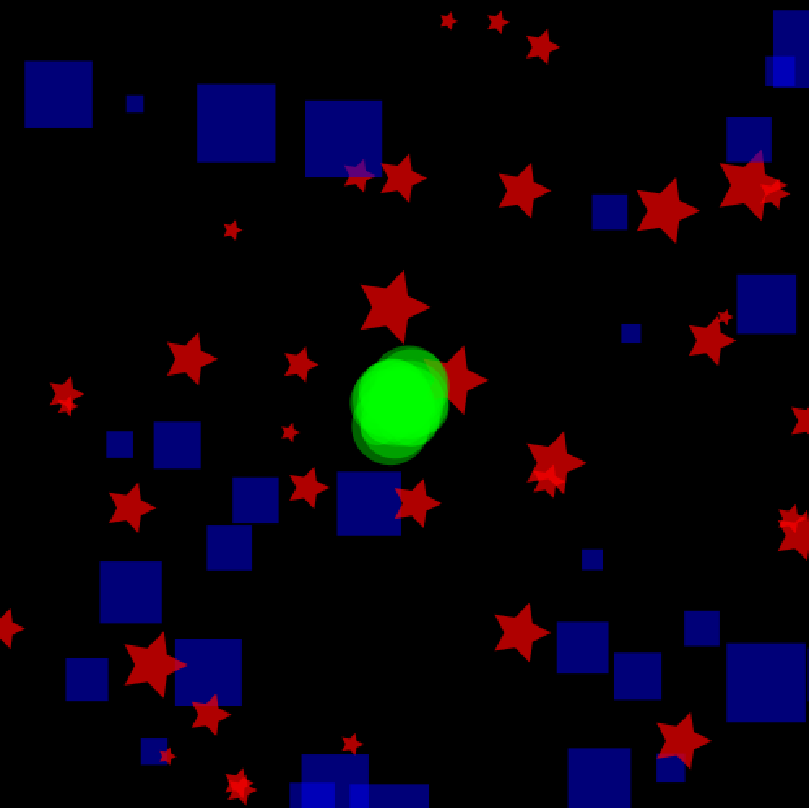
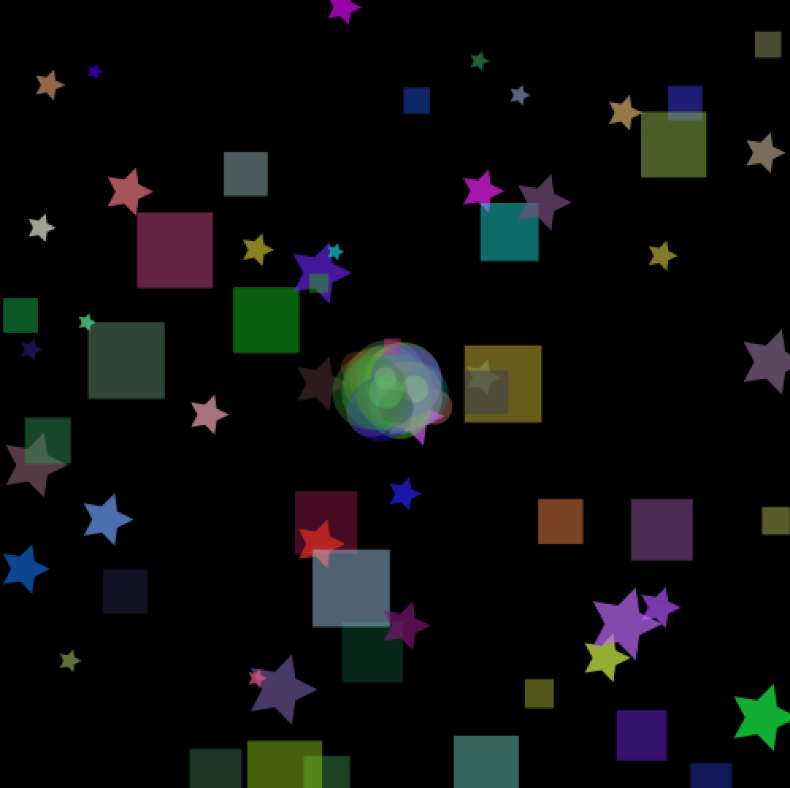

# Unit 2 - Programming Project: Dynamic Artwork

## Problem
  Create a dynamic piece of digital artwork using the Processing library in a Java IDE (Netbeans, Eclipse, IntelliJ, etc).

## Specifications
  * Program must be written entirely in Java
    * All submitted files should be .java files, no .pde files permitted in submission
  * Sketch must have at least 5 moving elements
  * Sketch must use at least 3 external classes
  * Code should demonstrate an understanding of the following concepts
    * Variables
    * Conditionals
    * Loops
    * Arrays
    * Object Oriented Programming
      * Classes
      * Access Modifiers
      * Inheritance
      * Abstract Classes
      * Polymorphism
    * Mouse Interaction
    * Keyboard Interaction
  * Sketch should include interaction instructions that are displayed on-screen while program is running

# [Solution](https://github.com/blwatkins/Data-Structures-From-A-New-Perspective/tree/master/2_AlgorithmAnalysis/Project/Solution/src)

<iframe width="560" height="315" src="https://www.youtube.com/embed/s6jCsv2xJ_s" frameborder="0" allowfullscreen></iframe>

