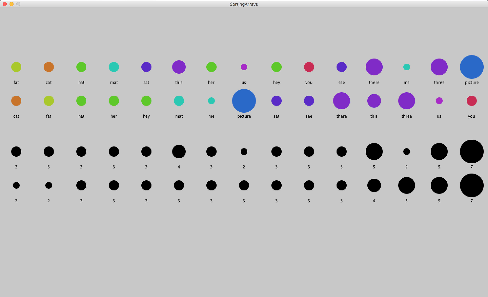
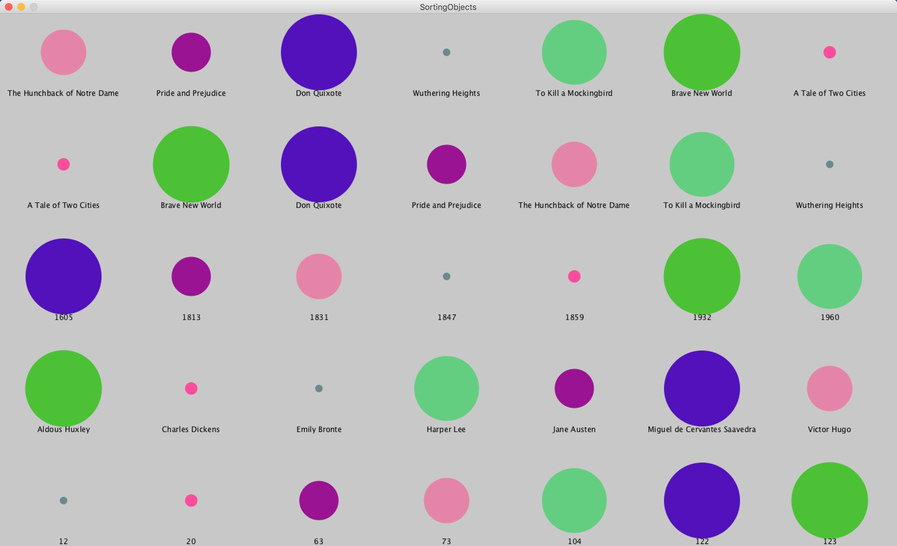
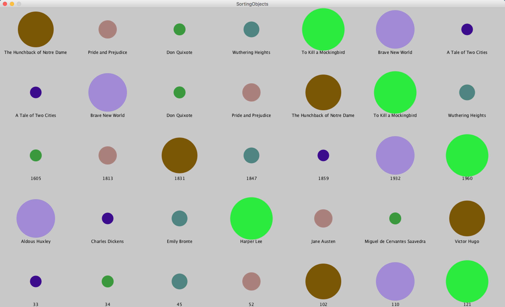
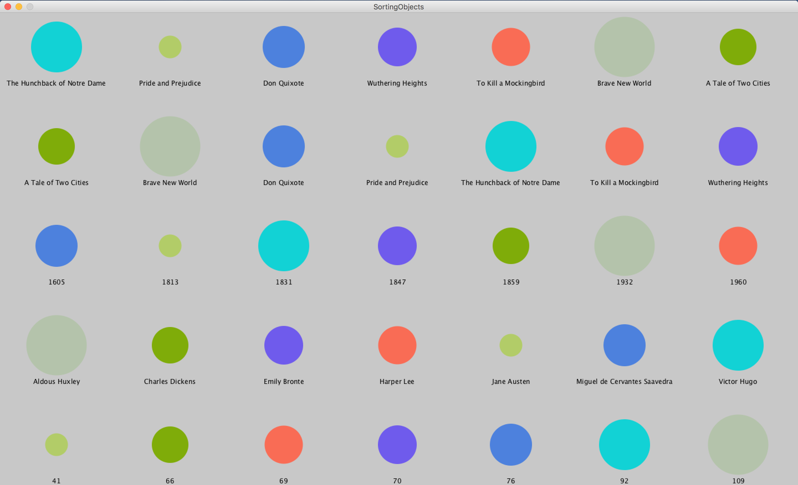
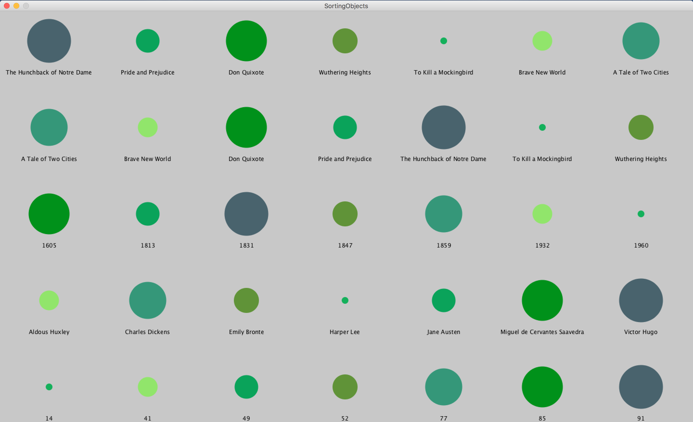

# Unit 3 - Day 1: Sorting in Java

## How do we sort things?
  * How do we sort a list of names? A stack of books? A shelf of video games?
  * How do we sort values in a computer program?
  * Most languages already have algorithms in place to sort values for us

## How do we sort an array of values in Processing/Java?
  * Processing's `sort(...)` function?

## How do we sort an array of objects in Processing/Java?
  * Creating a `Comparator`
  * Defining `compare(...)` functions

## [Sorting Arrays Example](https://github.com/blwatkins/Data-Structures-From-A-New-Perspective/blob/master/3_Sorting/LectureExamples/Day1/SortingArrays/src/SortingArrays.java)

## [Sorting Objects Example](https://github.com/blwatkins/Data-Structures-From-A-New-Perspective/tree/master/3_Sorting/LectureExamples/Day1/SortingObjects/src)

[Next: Sorting Objects](project.md)
