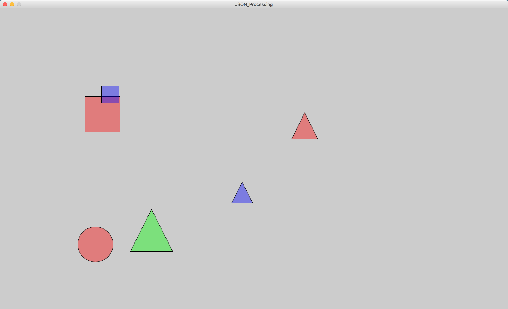

# Unit 4 - Lab: JSON

## JSON
  * What is JSON
    * JavaScript Object Notation
  * How are JSON files formatted?
    * JSON Objects
      * Object attributes
    * Arrays of JSON objects

## JSON in Processing
  * `JSONObject`
  * `JSONArray`
  * Loading in data
  * Accessing attributes of a `JSONObject`

## [JSON Object Example](https://github.com/blwatkins/Data-Structures-From-A-New-Perspective/blob/master/4_LinkedLists/LabExamples/Lab1/JSON/data/json_object.json)

## [JSON Array Example](https://github.com/blwatkins/Data-Structures-From-A-New-Perspective/blob/master/4_LinkedLists/LabExamples/Lab1/JSON/data/json_array.json)

## [JSON in Processing Example](https://github.com/blwatkins/Data-Structures-From-A-New-Perspective/blob/master/4_LinkedLists/LabExamples/Lab1/JSON/src/JSON_Processing.java)

[Previous: Linked Lists in Java](day3.md)

[Next: Implementing a Linked List](day4.md)
